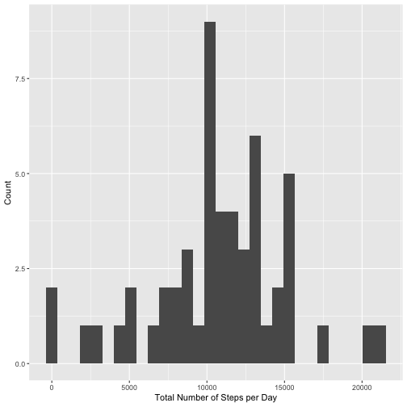
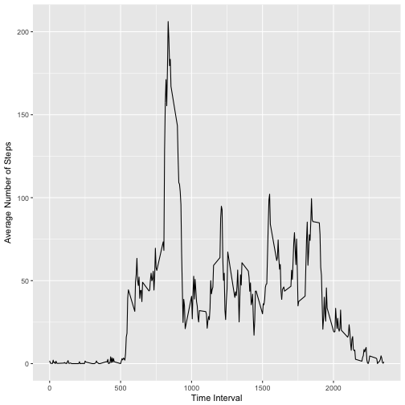
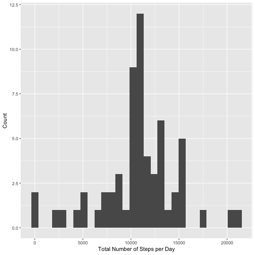
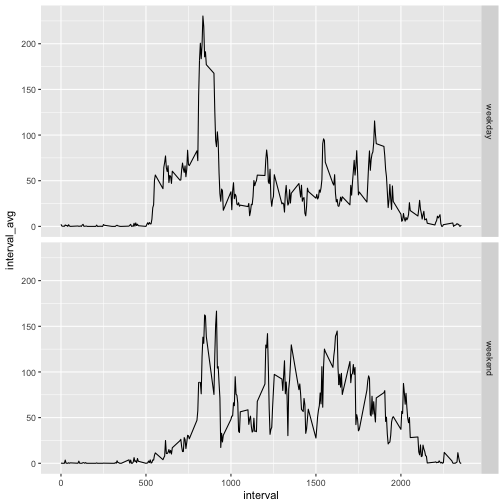

## Set up working directory & data
This just changes the working directory and unzips the datafile from the repo if necessary.


## Loading and preprocessing the data
First, we need to load in the data and transform the date variable from character to date.

```r
# Load in data
df <- read.csv("activity.csv", stringsAsFactors = FALSE)

# Transform date from character to date
df$date <- as.Date(df$date)
```

## What is mean total number of steps taken per day?


```r
library(tidyverse)

# Calculate total number of steps per day
steps <- df %>% group_by(date) %>%
    summarise(total = sum(steps))

# Make a histogram of the total number of steps taken each day
ggplot(data = steps) +
    geom_histogram(aes(x = total)) +
    labs(x = "Total Number of Steps per Day", y = "Count")
```



```r
# Calculate the mean and median of the total number of steps taken per day
avg_steps <- steps %>% summarise(average = mean(total, na.rm = TRUE))
med_steps <- steps %>% summarise(median = median(total, na.rm = TRUE))
```

The distribution of total number of steps per day is shown in the histogram above. The mean total number of steps per day is 10766.19 and the median is 10765.

## What is the average daily activity pattern?
 

```r
# Make a time series plot of the 5-minute interval (x-axis) and the average number of steps taken, averaged across all days (y-axis)
daily <- df %>% 
    group_by(interval) %>% 
    summarise(interval_avg = mean(steps, na.rm = TRUE))

ggplot(data = daily) +
    geom_line(aes(x = interval, y = interval_avg)) +
    labs(x = "Time Interval", y = "Average Number of Steps")
```



```r
# Find 5-minute interval, that on average across all the days in the dataset, contains the maximum number of steps
daily_max <- daily$interval[which.max(daily$interval_avg)]
```
The histogram above shows the average daily activity pattern. The 5-minute interval with the most activity is period 835.

## Imputing missing values

```r
# Calculate & report the total number of missing values in dataset
num_missing <- sum(!complete.cases(df))

# Strategy for filling in all the missing values in the dataset
# Use avg of interval across all days
df_noMiss <- df

# Create a new dataset with missing data filled in
df_noMiss$steps <- ifelse(is.na(df_noMiss$steps), daily$interval_avg[daily$interval %in% df_noMiss$interval], df$steps)

## Histogram with total number of steps
# Calculate total number of steps per day
steps_noMiss <- df_noMiss %>% group_by(date) %>%
    summarise(total = sum(steps))

# Make a histogram of the total number of steps taken each day
ggplot(data = steps_noMiss) +
    geom_histogram(aes(x = total)) +
    labs(x = "Total Number of Steps per Day", y = "Count")
```



```r
# Mean/Median for steps taken per day
avg_steps_noMiss <- steps_noMiss %>% summarise(average = mean(total))
med_steps_noMiss <- steps_noMiss %>% summarise(median = median(total))
```
There are 2304 missing values in the dataset. We can impute the missing values using a simply strategy where we set the missing value to the average from that interval. We already calculated the average in the previous segment. The histogram looks exactly the same as the previous one. We see the mean of this dataset is 10766.19 which is the same as previously and the median is 10766.19 which is slightly different than previously.

## Are there differences in activity patterns between weekdays and weekends?

```r
# Create factor for weekday/weekend
weekend_noMiss <- df_noMiss %>%
    mutate(day = weekdays(df_noMiss$date)) %>%
    mutate(day = factor(ifelse(day %in% c("Sunday", "Saturday"), "weekend", "weekday"))) %>%
    group_by(interval, day) %>% 
    summarise(interval_avg = mean(steps))

# Make a panel plot
ggplot(data = weekend_noMiss) +
    geom_line(aes(x = interval, y = interval_avg)) +
    facet_grid(day~.)
```



The plots above show the average number of steps by time interval for weekdays and the weekends. There is some difference between the two plots. For example, the avereage number of steps begans to pick up later in the morning and activity stays higher longer into the evening.
